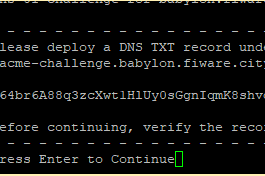

DRAFT DRAFT DRAFT DRAFT DRAFT DRAFT DRAFT DRAFT DRAFT DRAFT DRAFT DRAFT

### System requirements
Virtual machine with 4 cores, 4 GB of RAM and 40 GB disk. This guide is written for Ubuntu. How ever setup is also tested with CentOS.

### Placeholders in config files

To prevent secret leak to github, few placesholder tags are used: ```<secret> and <pass>```
	
some URLs have the name of the city removed, like: https://apis.city.apinf.cloud when deciding what URLs to use, replace with what ever URI component needed.

### Install Docker and Docker Compose
Note: Using “sudo” as my login user don’t contain all the privileges, but it’s in sudo group

	sudo apt-get update
	sudo apt-get upgrade
	sudo apt-get install apt-transport-https ca-certificates curl gnupg-agent software-properties-common git
	curl -fsSL https://download.docker.com/linux/ubuntu/gpg | sudo apt-key add -
	sudo add-apt-repository "deb [arch=amd64] https://download.docker.com/linux/ubuntu $(lsb_release -cs) stable"
	sudo curl -L "https://github.com/docker/compose/releases/download/1.24.1/docker-compose-$(uname -s)-$(uname -m)" -o /usr/local/bin/docker-compose
	sudo chmod +x /usr/local/bin/docker-compose
	sudo ln -s /usr/local/bin/docker-compose /usr/bin/docker-compose 

Sometimes it happens that docker doesn’t gets installed via above commands, in such a case, follow this (Saviour Command):-

	sudo apt install docker.io

After installation has completed, start the Docker daemon:

	sudo systemctl enable docker
	sudo systemctl start docker

Verify that it’s running:

	sudo systemctl status docker

Open port 443(https) (depending on what firewall is used: ufw is Ubuntu default)

	sudo firewall-cmd --add-service=https
	sudo ufw allow https
	

### Clone the GitHub repository and suggested placing

	cd /opt
	sudo git clone https://github.com/<project_location>.git
	
The repository currently holds the configurations under config folder. Copy those to a designated folder, for example /opt/&lt;project>/ so that the outcomde is /opt/&lt;project>/config/ and /opt/&lt;project>/services/


### Create Directories

Create directories(bind mounts) required by each “yaml” file volume on host machine

	sudo mkdir -p /opt/mongo-data /opt/wirecloud-static 	/opt/wirecloud-data /opt/wirecloud-elasticsearch 	/opt/wirecloud-postgres /opt/quantumleap-crate /opt/quantumleap-redis /opt/keyrock-mysql 	/opt/umbrella-elasticsearch  /opt/proxy-static

### Max_map_count

Container “quantumleap_crate” needs a specific “max_map_count” to be in the running state. Perform the following steps

	sysctl vm.max_map_count

if the output is “262144”, skip this and proceed else do the things below

	sudo vim /etc/sysctl.d/10-opplafy.conf
	vm.max_map_count=262144
	sudo sysctl -p /etc/sysctl.d/10-opplafy.conf


### Changes in Config Files

NOTE: these changes to keyrock.js are in this repository files already, but are needed, if vanilla components are used. So please check for these changes:

Add to file “config/keyrock.js” Please add it before “module.exports = config;” in the file
	
	sudo vim config/keyrock.js
	// Enable usage control and configure the Policy Translation Point
	 config.usage_control = {
	 enabled: to_boolean(process.env.IDM_USAGE_CONTROL_ENABLED, false),
	 ptp: {
	 host: (process.env.IDM_PTP_HOST || 	'localhost'),
	 port: (process.env.IDM_PTP_PORT || 8081),
	 }
	 }

Change the default token validity period to desired value.

	sudo vim config/keyrock.js
	
	
	//access_token_lifetime: 60 * 60,  // One hour
	access_token_lifetime: 60 * 60 * 60 * 146,  // Changed to one year by sumedh

	//token_lifetime: 60 * 60           // One hour
	token_lifetime: 60 * 60 * 60 * 146  // Changed to one year by sumedh

keyrock has few user / password combinations idetified with ```<pass>``` which need to be matching.

Domains are defined in /etc/hosts, for example:

	127.0.0.1 localhost localhost.localdomain localhost4 localhost4.localdomain4 	example.com accounts.example.com apis.example.com context.example.com market.example.com sthdata.example.com umbrella.example.com dashboards.example.com ngsiproxy.example.com example

You need to that example.com must be replaced through the actual domain intended to be used for the setup and you must actually modify the /etc/hosts file.

For this configuration to work, you need a public IP so that the Let's Encrypt scripts can run successfully. a wildcard record 

	*.example.com 
	
need to be pointing to the host / cluster gateway.

Add “CNAME” entries/aliases for all the subdomains you desire to work on in your DNS server.

### Add Certificates

Add certificates for the domain “example.com” via letsencrypt certbot tool

	sudo yum install certbot python2-certbot-nginx # yum for Centos
	sudo add-apt-repository ppa:certbot/certbot
	sudo apt-get update
	sudo apt-get install python-certbot-nginx

INSTALLATION:

	sudo certbot certonly --manual --preferred-challenges dns-01 --server https://acme-v02.api.letsencrypt.org/directory --email xyz@test.com --manual-public-ip-logging-ok --agree-tos -d *.example.com

Please not that instead of xyz@test.com use a real email address.

Deploy a DNS TXT record provided by Let’s Encrypt certbot after running the above command = send this to DNS controller, this part:

 the _acme challenge and the hash. Wait 2 minutes and press enter.


if you get this, it’s fine:
	IMPORTANT NOTES:
 	- Congratulations! Your certificate and chain have been saved at:

RENEWAL:

	sudo docker service rm example_umbrella
	sudo certbot certonly --force-renew --manual --preferred-challenges dns-01 --server https://acme-v02.api.letsencrypt.org/directory --email xyz@test.com --manual-public-ip-logging-ok --agree-tos -d *.example.com
	sudo vim services/umbrella.yml
	
Change certificate name under “secrets” section. OLD:-

	umbrella.crt:
		name: umbrella.crt-v9
	umbrella.key:
		name: umbrella.key-v9
		
NEW:-

	umbrella.crt:
		name: umbrella.crt-v10
	umbrella.key:
		name: umbrella.key-v10

This can be run in the scenario where all the other components are running. If you are doing this the 1st time, do not execute the following.

	sudo docker stack deploy -c services/umbrella.yml <stack>

CERTS RENEWAL:

	sudo docker service rm example_umbrella
	sudo docker service rm example_nginx
	sudo service nginx stop
	sudo certbot certonly --force-renew --cert-name example.com
	sudo vim services/umbrella.yml
		Change certificate name under “secrets” section
		OLD:-
			umbrella.crt:
				name: umbrella.crt-v9
			umbrella.key:
				name: umbrella.key-v9
		NEW:-
			umbrella.crt:
				name: umbrella.crt-v10
			umbrella.key:
				name: umbrella.key-v10
	sudo docker stack deploy -c services/umbrella.yml <stack>
	sudo docker stack deploy -c services/nginx.yml <stack>
	sudo service nginx start

### Umbrella and Maxmind license

There has been updates to maxmind license that umbrella uses. Please see issue: https://github.com/Profirator/api-umbrella/issues/2

### Replacing URL in services folder

the YML files have urls that need to be correct for your environment. Please replace the URLs in these files before deploying the stack:

	services/ckan.yml
	services/keyrock.yml
	services/mail.yml
	services/tenant-manager.yml
	services/umbrella.yml
	services/wirecloud.yml
	
here is an example command how to run, if you do not want to do this manually:

	find services/ -type f -exec sed -i 's/lubeck\.apinf\.cloud/newsubdomain\.example\.com/g' {} +

### Swarm Mode

Current setup is designed to run on single machine. Swarm is used so it can be extended later to a true cluster setup.

Services are really just “containers in production”. So it takes some time for containers to be up. Use below command to enable swarm mode and make your current machine a swarm manager. Before we can use the “docker stack deploy” command we first run:
sometimes IP tables need to be flushed. If it looks like that dockers are not able to connect, try this:

	sudo iptables -t filter -F
	sudo iptables -t filter -X
	sudo systemctl restart docker
	sudo docker swarm init

NOTE: If you don’t run the above command, you get an error that “the node is not a swarm manager.”

Deploy Services in Docker Swarm and Other Configurations

Deploy APInf city services onto the stack in following order

NOTE: Here, <stack_name> is the stack name. Secrets, passwords and urls have to be configured before stack deploy. example.com needs to be changed to the domain of your configuration. 

	sudo docker stack deploy -c services/mongo.yml -c services/nginx.yml -c services/ngsiproxy.yml -c services/orion.yml -c services/quantumleap.yml -c services/keyrock.yml -c services/umbrella.yml -c services/apinf.yml <stack_name>

### Configuration Changes in Umbrella

Signup at - https://umbrella.example.com/admin/ and register website back-ends

Configuration -> Website Backends -> Add Website Backend

	Frontend Host: accounts.example.com
	Backend Protocol: http
 	Backend Server: keyrock
 	Backend Port: 3000

 	Frontend Host: apis.example.com
 	Backend Protocol: http
 	Backend Server: apinf
 	Backend Port: 3000

 	Frontend Host: dashboards.example.com
 	Backend Protocol: http
 	Backend Server: wirecloudnginx
 	Backend Port: 80

 	
Frontend Host: example.com
 	
	Backend Protocol: http
 	Backend Server: nginx
 	Backend Port: 80

 	Frontend Host: ngsiproxy.example.com
 	Backend Protocol: http
 	Backend Server: ngsiproxy
 	Backend Port: 3000

	Frontend Host: umbrella.example.com
 	Backend Protocol: http
 	Backend Server: nginx
 	Backend Port: 80


REMEMBER TO PUBLISH CHANGES in Umbrella.

Change hard-coded “Oauth2 credentials” for “Wirecloud” and “API Access”

Login to “accounts.example.com” and add applications for “Wirecloud” and then get its “Oauth2 credentials”

1. Login credentials

username: admin@test.com
password: <pass>

2. Register (In applications menu)

		API Access
 		Name: API Access
		Description: OAuth2 Application used to control access to internal services like the Context Broker, the STH data, the CEP, ...services
 			Url: https://example.com
	 		Callback Url: https://example.com
 			Add Roles: tenant-admin, data-provider, data-consumer
	 		Token Type – JSW, Permanent 			
	 		Authorize users: admin - assign roles - ALL
			
 example API Catalogue (Login)
 
 			Name: example API Catalogue
	 		Description: Catalogue of example APIs provided using APInf
 			URL: https://apis.example.com
	 		Callback URL: https://apis.example.com/_oauth/fiware
 			Signout URL: https://apis.example.com
	 		Add Roles: tenant-admin, data-provider, data-consumer
			Token Type – JSW, Permanent 
			Authorize Users: admin – assign roles - ALL
			
example Dashboards (Wirecloud)

 			Name: example Dashboards
 			Description: Dashboard portal for example
 			URL: https://dashboards.example.com
 			Callback URL: 	https://dashboards.example.com/complete/fiware/
	 		Add Roles: admin
			Authorize Users: admin - assign roles - ALL
 		
Applications(after adding all applications): example API Catalogue, example Dashboards.

3. Get Oauth2 credentials for all applications
Change the oauth2 credentials which are hard-coded for “example Dashboards Wirecloud”

		sudo vim services/wirecloud.yml
 		
Change “SOCIAL_AUTH_FIWARE_KEY” and “SOCIAL_AUTH_FIWARE_SECRET” to new “Client_ID” and “Secret” respectively.

Change the oauth2 credentials which are hard-coded for “API Access” 

	sudo vim config/tenant-manager/credentials.json

Then bring up the followong services:
	
	sudo docker stack deploy -c services/tenant-manager.yml -c services/wirecloud.yml <stack_name>


Visit https://umbrella.<domain>/admin


Configuration -> API Backends -> Add API Backend

Name: Orion Context Broker

click “Add Server”

	Host: orion.docker
	Port: 1026
	Frontend Host: context.example.com
	Backend Host: context.example.com

click “Add URL Prefix”

	Frontend Prefix: /v2/
	Backend Prefix: /v2/

Global Request Settings:

	Allow External Authorization
	IDP App ID: <client_id> of “API Access” IDM application
		Note:- login to Idm and get the API Access OAuth credentials. Client id from idm goes to “Idp app id”
	Required Roles: orion-admin
	Rate Limit: Unlimited requests

Sub-URL Request Settings:
	
	Click on “Add URL Settings”
	GET – Regex: ^/v2/.* - Override required roles from "Global Request Settings"(Checkbox)<-NOTE! this should be added ONLY if we want an open system where anyone can get the information!
 	any – Regex: ^/v2/subscriptions – Override required roles from "Global Request Settings"(Checkbox)
	OPTIONS – Regex: ^/v2/.* - API Key Checks: Disabled – Override required roles from "Global Request Settings"(Checkbox)
	any – Regex: ^/v2/op/notify$ - API Key Checks: Disabled – Override required roles from "Global Request Settings"(Checkbox)
	any - Regex: ^/v2/op/update$ - Override required roles from "Global Request Settings"(Checkbox)
	POST - Regex: ^/v2/notify$ - Override required roles from "Global Request Settings"(Checkbox)
	DELETE - Regex: ^/v2/.* - Required Headers: fiware-delete: jOW@11hx7 - Override required roles from "Global Request Settings"(Checkbox)

SAVE


 Name: Quantum Leap
click “Add Server”

	Host: quantumleap.docker
	Port:8668
	Frontend Host: sthdata.example.com
	Backend Host: quantumleap.docker
	click “Add URL Prefix”
	Frontend Prefix: /ql/
	Backend Prefix: /

Global Request Settings:

	Allow External Authorization
	IDP App ID: <client_id> of “API Access” IDM application
		Note:- login to Idm and get the API Access OAuth credentials. Client id from idm goes to “Idp app id”
	API Key Checks: Required – API keys are mandatory
 	Required Roles: orion-admin
	Rate Limit: Unlimited requests
 	Override Response Headers:
 		Access-Control-Allow-Origin: *
		Access-Control-Allow-Headers: Authorization, FIWAREService, FIWAREServicePath
		Access-Control-Allow-Credentials: true

Sub-URL Request Settings:

	Click on “Add URL Settings”
	GET – Regex: ^/v2/version$ - API Key Checks: Disabled – Override required roles from "Global Request Settings"
 	GET – Regex: ^/v2/.* - Override required roles from "Global Request Settings" <-NOTE! this should be added ONLY if we want an open system where anyone can get the information!

SAVE


Name: Tenant Manager
click “Add Server”

	Server: tenantmanager
	Host: 5000
	Frontend Host: umbrella.example.com
	Backend Host: umbrella.example.com
	Click “Add URL Prefix”
	Frontend Prefix: /tenant-manager/
	Backend Prefix: /

Global Request Settings:

	Allow External Authorization
 	IDP App ID: <client_id> of “example API Catalogue” IDM application
		Note:- login to Idm and get the API Access OAuth credentials. Client id from idm goes to “example API Catalogue”
	Required Roles: tenant-admin
 	Rate Limit: Unlimited requests
 Sub-URL Request Settings:

Click “Add URL Settings”

	GET – Regex: ^/ – Override required roles from "Global Request Settings"
SAVE


Name: Token Service
Click “Add Server”
	
	Server: keyrock
	Port: 3000
	Frontend Host: accounts.example.com
	Backend Host: keyrock

Click “Add URL Prefix”

	Frontend Prefix: /oauth2/password
	Backend Prefix: /oauth2/token

Global Request Settings:

	API Key Checks: Disabled
 	Rate Limit: Unlimited requests
SAVE

Go to https://umbrella.example.com/admin/#/config/publish
   
PUBLISH

Note: example.com will be replaced by your desired domain name

### Add Proxies, Login Platforms and APIs in APInf Platform


Sign up to APInf platform at “apis.example.com” as 	“Admin”. If no user, first user signing up will be admin.
Enter username, email, password and Register
You’ll be signed in and will be admin
 	
Settings > Proxies
Orion Context Broker
	
	Name: Orion Context Broker
 	Description: API umbrella installation for the Orion Context Broker service at example.
 	Type: apiUmbrella
 	URL: https://context.example.com
 	API Key: <umbrella_key>
 	Auth Token: <umbrella_account_token>
 	ElasticSearch: http://elasticsearch.docker:9200
Quantum Leap

	Name: Quantum Leap
 	Description: API umbrella installation for the Quantum Leap service at example.
 	Type: apiUmbrella
 	URL: https://sthdata.example.com
 	API Key: <umbrella_key>
 	Auth Token: <umbrella_account_token>
 	ElasticSearch: http://elasticsearch.docker:9200
 	
Login Platforms
FIWARE
	
	Client id: <client_id> 	from “example API Catalogue” application
 	Secret: <secret> from “example API Catalogue” application
 	Root url: https://accounts.example.com

Settings
	
- Only platform administrators are allowed to add new APIs
- Only platform administrators are allowed to add new Organizations


Mail – enabled

	Username: noreply@apis.example.com
	Password: <your_password>
 	SMTP Host: <mailserver url>
	SMTP Port: 587
 	
Email for sending mails: noreply@apis.example.com

Disabled login methods
		Github, Hsl id

Tenant Manager – enabled
 		Url and basepath: https://umbrella.example.com/tenant-manager/
 	
Add APIs
Orion Context Broker

	API Name: Orion Context Broker
	Description: Context information provided using the FIWARE Orion Context Broker in right-time
 	API Host URL: http://orion.docker
 	Settings(General)
		API visibility: Public
		Network - Menu
 			Proxy: Orion Context Broker
	 		Proxy base path: /v2/
 			API base path: /v2/
	 		API Port: 1026
 			IDP App Id: <example API Catalogue – client_id>
	 		Rate limit mode: Unlimited requests
SAVE CONFIGURATION


Endpoints

	Provide API documentation via: URL
 	Link to API documentation: https://raw.githubusercontent.com/Fiware/specifications/master/OpenAPI/ngsiv2/ngsiv2-openapi.json
 	Allow all methods
	Monitoring
		Endpoint to monitor: :1026/version


Quantum Leap, add another API:

API Name: Quantum Leap
	
 Description: QuantumLeap is the first implementation of an API that supports the storage of NGSI FIWARE NGSIv2 data into a time-series database.

	API Host URL: http://quantumleap.docker
 	Settings
		API visibility: Public
	Network - Menu
 		Proxy: Quantum Leap
 		Proxy base path: /ql/
 		API base path: /
 		API Port: 8668
 		IDP App Id: <example API Catalogue – client_id>
 		Rate limit mode: Unlimited requests	
	 
 Endpoints
 
 	Provide API documentation via: URL
 	Link to API documentation: https://raw.githubusercontent.com/smartsdk/ngsi-timeseries-api/master/specification/quantumleap.yml
 	
Allow “GET” method only

	Monitoring
		Endpoint to monitor: :8668/v2/version
 	
Settings -> Branding -> About
 
 	Site title: example
	Showcase APIs: “Quantum Leap” AND “Orion Context Broker”


CHANGE PASSWORD FOR USER ADMIN IN “IDM” - https://accounts.lubeck.apinf.cloud/
			OR
ADD NEW ADMIN USER AND DISABLE ADMIN IF IT HAS WEAK PASSWORD


### Mail server configuration - after mailgun changes

IF YOU HAVE YOUR OWN MAIL-SERVER - SEE BELOW MAILGUN INSTRUCTION

Mailgun:
Swaks is an smtp of CURL, install it first

	sudo curl http://www.jetmore.org/john/code/swaks/files/swaks-20130209.0/swaks -o swaks


Set the permissions for the script so you can run it
sudo chmod +x swaks


It's based on perl, so install perl

	sudo apt-get -y install perl


Now SEND
	sudo ./swaks --auth --server smtp.mailgun.org --au postmaster@YOUR_DOMAIN_NAME --ap as3kh9umujora5 --to bar@example.com --h-Subject: "Hello" --body 'Testing some Mailgun awesomness!'


Grab your SMTP credentials: 

SMTP hostname: smtp.eu.mailgun.org
	Port: 587 (recommended)
	Username: postmaster@example.com
	Default password: <pass>

Make changes in keyrock.yml & ckan.yml & API Platform mail settings

Make changes in keyrock.js in “config.mail”

	#host: ‘mail’,
	host: ‘smtp.eu.mailgun.org’,

and deploy changed settings:

	sudo docker stack deploy -c services/keyrock.yml example

With your own mail-server you only need to make changes into the configuration files: 
services/keyrock.yml

	SMTP_USER=your@email.user
	SMTP_PASS=YourEmailPassword
	services/ckan.yml
	#Email Settings
	- CKAN_SMTP_SERVER=your.email.server
	- CKAN_SMTP_USER=your@email.user
	- CKAN_SMTP_PASSWORD=YourEmailPassword
	- CKAN_SMTP_MAIL_FROM=your@email.user

config	/keyrock.js (replace 587 if your port is different!)

	config.mail = {
    host: 'your.email.server',
    port: 587,

These configuration changes might need the stack to be re-deployed. Replace YourStackName with your stacks name.

Remove stack:

	sudo docker stack rm YourStackName

Re-deploy stack (from repository folder):
	sudo docker stack deploy  -c services/tenant-manager.yml -c services/wirecloud.yml  YourStackName

	sudo docker stack deploy -c services/mongo.yml -c services/nginx.yml -c services/ngsiproxy.yml -c services/orion.yml -c services/quantumleap.yml -c services/keyrock.yml -c services/umbrella.yml -c services/apinf.yml YourStackName

### Apache Nifi deployment:

	sudo docker stack deploy -c services/nifi.yml
	
### Basic map visualisation deployment:

	sudo docker stack deploy -c services/leafletgis.yml

### Grafana deployment:

	sudo docker stack deploy -c services/grafana.yml
