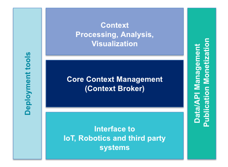
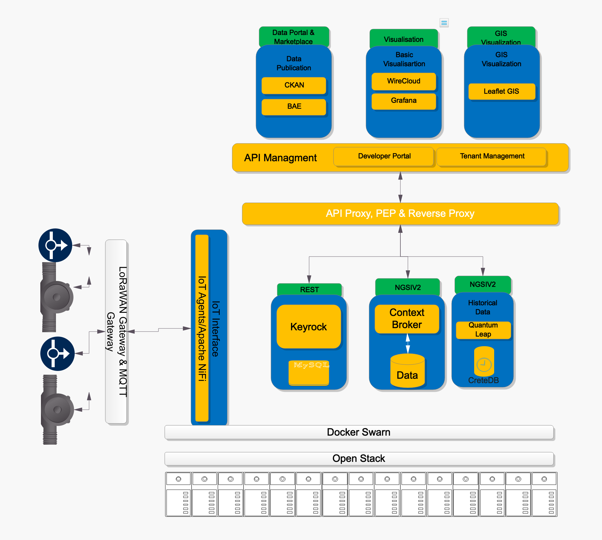
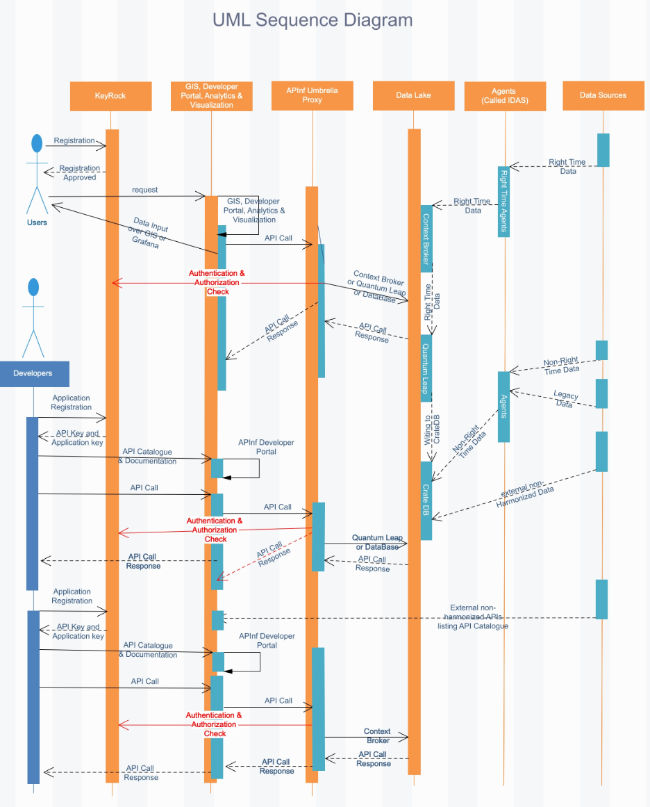
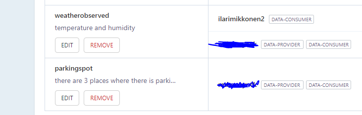
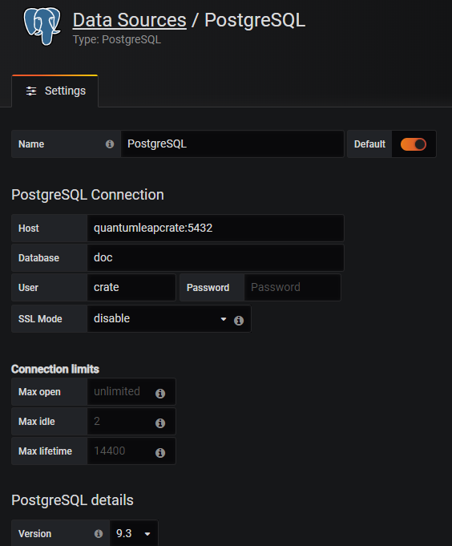
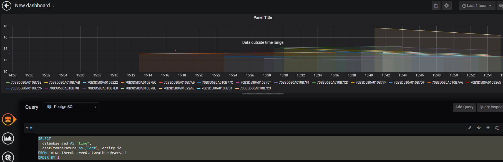
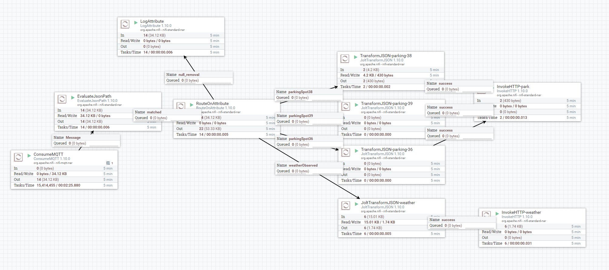

## Master documentation

### Preface
This basic is documentation of FIWARE based PoC setup for smart cities and communities. Basic documentation is:
Overview of structure, functionality and basic usage.

Basic documentation is not:
- Complete tutorial on every feature of the FIWARE components.
- Debugging reference.

The FIWARE PoC is:
- Proof of Concept on how the FIWARE and other open source components work together.

The FIWARE PoC is not:
- Production ready
- High available
- For public usage
- Security tested by 3rd party.

Intended Audience are those who are interested in FIWARE based platforms and their basic example setup. 

With the PoC we prove the feasibility and viability of FIWARE based platform for smart cities. 

With the links in this documentation, please **replace** the <cityname> with the name of the city, or observe another URL scheme.


### Overall Architecture / structure

General Information about the Components can be found in the FIWARE Catalogue: https://www.fiware.org/developers/catalogue/



FIWARE is a collection of components that can be combined together. Here we have created a configuration that allows basic integrations between the components. It is not by all means be-all-end-all solution, but something we hope that ecosystem players can grow and develop together.

This deployment touches all the areas of FIWARE reference architechture, but is not utilizing all the available components in the Catalogue. It is not feasible to put all possible tools in one deployment; here we have tried to collect and configure a meaningful set of components that makes testing of FIWARE stack possible; It can and should be extended as requrements and needs arise.

FIWARE is also a ever moving and developing landscape; new components arise and some are depricated.

The following components are deployed:

- [Orion Context broker for real time data](#orion-context-broker)
- [Quantum leap for historical data](#quantumleap)
- [Apache Nifi](#apache-nifi)
- [Identity manager- Keyrock](#identity-manager)
- [Grafana for data visualizations](#grafana)
- [API management](#api-management)
- [API proxy](#api-proxy)
- [Basic map Visualization](#basic-map-visualisation)
- [Open Data Portal-CKAN](#open-data-portal-ckan) 
- [Wirecloud Portal](#wirecloud-portal)
- [Tenant Manager](#tenant-manager)

Snapshot of running services is in [this list](service-list-270302020.md)

Services map to the components in the following manner: Keyrock uses Mysql as database. Leaflet GIS is Basic map visualisation. Orion uses Monga DB, Quantumleap uses Crate and Redis. Nifi is Apache Nifi, Nginx is used to prevent users ending up in Umbrella Proxy page accidentally. Umbrella API proxy uses Elastic Search for analytics. Zookeeper is used by Apache Nifi. 

High level architecture:


More information on the components can be found on [FIWARE catalog page](https://www.fiware.org/developers/catalogue/), and on their respective sites (Apache Nifi and Grafana). Basic map visualisation is developed from scratch for this project.

### UML Diagram

The diagram gives an example of the flow for two use cases; User registration and Developer.

User needs to create a Keyrock account. With this account, user can log in to the applications, and get Oauth tokens. Developer flow gives and example how developer can access data using token/key.



### Onboarding users / new user creation

Sign up at https://accounts.<cityname>.apinf.cloud/ (you need to confirm email address). Please note that there is a know issues on using dots "." in user names: https://github.com/Profirator/Profi-platform/issues/2

Sign in at https://apis.<cityname>.apinf.cloud/ using FIWARE login

The NGSI V2 API is exposed at https://context.<cityname>.apinf.cloud/v2/ and

https://sthdata.<cityname>.apinf.cloud/ql/ for historical data

Accesses for data can be handled by using Oauth Bearer tokens. Once you have signed in, you can fetch a token from platform:


This will allow you to access all the tenants on the Context Broker you have access to. Please see [documentation](https://apinf-fiware.readthedocs.io/en/latest/#tenant-manager-ui) on how to add tenants.

In deployment context, there are two Tenants:



Tenants have one-to-one fiware-service - tenant mapping; one Tenant is used to control access to fiware service. Altough it is possible to put what ever data in one Tenant, it's a good idea to keep one-to-one Tenant Datamodel mapping.

The one-to-one mapping means that what ever is the tenant name (for example test1) is the same as the Fiware Service. So in order to access data on the "test1" tenant, you need to set the fiware service header value to "test1": 

```
fiware-service : test1
```

Tenant owner needs to authorize users to the tenants; If you do not have authorization, you don't have the visibility to the tenants.

### Component overview and documentation:

### Tenant Manager

Tenant manager is a middleware orchestration component. It will take requests for API Management for Tenants and configure Keyrock IDM and Umbrella Proxy accordingly.

How to is covered in: [Tenant-manager documentation](https://apinf-fiware.readthedocs.io/en/latest/#tenant-manager-ui)

### Grafana

Grafana is a videly used data visualisation and charting tool which connects to Crate DB.

### Basic map Visualisation

Landing page: https://gis.<cityname>.apinf.cloud/ holds two sub pages, one for static data and another one with Weather observed and ParkingSpot. 

### Orion Context broker

For right time data access via NGSI v2 API. Orion Context Broker allows you to manage the entire lifecycle of context information including updates, queries, registrations and subscriptions. It is an NGSIv2 server implementation to manage context information and its availability. Using the Orion Context Broker, you are able to create context elements and manage them through updates and queries. In addition, you can subscribe to context information so when some condition occurs (e.g. the context elements have changed) you receive a notification. Documentation can be found [here](https://fiware-orion.rtfd.io/) .

### Quantumleap 

For historical data. Data that arrives to Orion Context Broken, can be stored in QuantumLeap via subscription mechanism. QuantumLeap is the first implementation of an API that supports the storage of NGSI FIWARE NGSIv2 data into a time-series database, known as ngsi-tsdb. Accessed via NGSI v2 API. Documentation can be found [here](https://github.com/smartsdk/ngsi-timeseries-api/).


### Apache Nifi

Apache Nifi is used to process data flow, in this case convert mqtt into NGSI Json payload. End users shall not access / use Apache Nifi. Configuration is described later in the documentation.

### Identity manager

Identity manager (keyrock) is configured and needed for initial user account creation. More documentation [here](https://fiware-idm.readthedocs.io/en/latest/)

The API management has a plugin which allows users to use Keyrock accounts to login. Keyrock (as IDM) has the notion of Organisations and Applications. When the API management is configured with an Keyrock application, this allows login to the API management with keyrock accounts. This (or separate) application can also be used to generate Oauth2 tokens to control the Tenant access. If a separate token service is in use, several applications can be used. Otherwise it is recommended to use one application for login and Tenant access. Further more, Tenant manager uses keyrock to fetch information on the users. API umbrella can (when a request with Oauth bearer token comes in) then send the token to Keyrock for introspection. 

### API management 
API Management is a central part and used to set Tenant accesses, host API documenation and provide analytics. Usage in relevant parts are described in this documentation. More information can be found [here](https://github.com/apinf/platform)

### API proxy
All traffic is routed via API Proxy, which allows access control. End users shall not access API-umbrella. 
API Proxy is based on the NREL/Api-umbrella. NREL documentation is [here](https://api-umbrella.readthedocs.io/en/latest/)

### Open Data Portal CKAN 
Is installed, but not configured; service not up to avoid confusion with another deployment. General documentation can be found [here](https://fiware-ckan-extensions.rtfd.io/), and the dedicated CKAN documentation is [here:](https://github.com/Profirator/project-config/blob/master/docs/CKAN%20Open%20data%20portal%20documentation.pdf) 

### Wirecloud Portal

Wirecloud is a mashup visualisation tool. It is installed, but not configured. Documentation can be found [here](https://wirecloud.rtfd.io/)

### Grafana example setup

Access via https://charts.<cityname>.apinf.cloud/ the admin access is secured by password, which is in the grafana.yml Otherwise, Grafana usage is standard; connect database:


and configure the charts you need:


example SQL query:
```
SELECT
  dateobserved AS "time",
  cast(temperature as float), entity_id
FROM  mtweatherobserved.etweatherobserved
ORDER BY 1
```

### Broker subscriptions

Orion Context broker and NGSI-V2 API provides a powerful feature that you can take advantage of: the ability to subscribe to context information so when "something" happens (we will explain the different cases for that "something"), your application will get an asynchronous notification. This way, you don't need to continuously repeat query requests (i.e. polling). The Orion Context Broker will let you know the information when it arrives. 

To make a subscription so that data from Orion context broker is persisted in Quantumleap / Crate DB, you need to make (POST to https://context.<cityname>.apinf.cloud/v2/subscriptions) a subscription. An example: 

```

{
        "description": "nifi11 test sub for mongo/crate interaction",
        "subject": {
          "entities": [{ "idPattern": ".*" }],
          "condition": { "attrs": [] }
        },
        "notification": {
          "attrs": [],
          "http": { "url": "http://quantumleap:8668/v2/notify" },
          "metadata": ["dateCreated", "dateModified", "timestamp"]
        }
      }
      
```

more on subscriptios in Orion Context broker [documentation](https://fiware-orion.readthedocs.io/en/master/user/walkthrough_apiv2/index.html#subscriptions) .

### Niota connection and dataflow

This PoC is getting it's real time data from a Niota (travehub.luebeck.digital) platfrom. Information is routed via Apache Nifi, and fed to Orion Context broker. In Niota, there is an mqtt consumer, which the Apache Nifi is subscribing to.

From Orion context broker, data is being fetched by the Basic Map Visualisation and shown. The data that is currently shown is Weather observed (temperature and humidity)  and ParkingSpot (from 3 different sensors).

In Additionto this, Quantumleap subscribes to Orion, and stores the WeatherObserved data to Crate DB. Grafana accesses the Crate DB to provide visualisations.

The requirement is that the is a consumer provided by niota administrator. If niota is not available, the data is not available on the PoC platfrom.

The parking spot data is sensitive for data flow interruptions, as the sensors submit data only when state changes. Weather sensor does not suffer from this, the state is updated regularly.

Information on how to configure the data flow is covered in section [Apache Nifi configuration](#apache-nifi-configuration)

### Connecting new datasources

This section applies when data is available via mqtt topic, which can be subscribed to. Inorder to access the data, you need to have credentials to subscribe to the Niota provided mqtt broker.

1) Sign in to Niota.
2) Look up for the mqtt credentials in Niota.
3) Check what kind of payload you get from devices.
4) Plan what data do you need and can use from the payload.
5) Check for existing FIWARE datamodel in [FIWARE datamodels](https://www.fiware.org/developers/data-models/). If not, create new one following the guidelines and consider contributing to FIWARE.
6) Design a Apache Nifi flow. Current configuration is given in section "Apache Nifi configuration"


### Basic map visualisation information

Source code is in github: https://github.com/Profirator/project-config

Source code is under [this](https://github.com/Profirator/project-config/tree/master/leaflet) repo. You can build docker container:
```
docker how to: docker stop leaflet01 ; docker rm leaflet01 ; docker build -t {org}/{tag}:{version} . ; docker run -dit --name leaflet01 -p 8181:8181 {org}/{tag}
```

### Adding data to the map

This section assumes that the data is avaialble in Orion context broker, and you have basic coding (copy-paste) skills.

When the data is under a new fiware-service, the easiest way is to add it to the map is to take a look at the Leaflet code at the base of this repository and modify it. The data fetch is done in the index.html in "leaflet/cb02/index.html".

Once code changes are done, create a new docker. Optionally push it to the repo. Deploy the new docker by changing the image in leafletgis.yml (details in [configure.md](configure.md) ) and redeploy to the server:

	sudo docker stack deploy -c services/leafletgis.yml

### Apache Nifi configuration
Currently Apache Nifi is collecting data from Niota mqtt server. The data that is arriving is Environmental data (WeatherObserved data model) and Parking data (ParkingSpot data model).

Process flow in high level is as follows:
1) ConsumeMQTT processor listens to Niota mqtt broker and subscribes to a topic tree:consumers/35/apps/+/devices/+/fiware
2) EvaluateJsonPath receives traffic and attaches an "$.application_id" property to the flow file.
3) RouteOnAttribute processor looks at the application id variable and flow is directed to four different processors: one for WeatherObserved and three for different parking sensors:
```
3 Types of Sensors, 3 different payloads for the status
Libellium   
Application	CBB Consulting Parkraum Überwachung
application_id	38
device_type_id	91
occupied	true/false
	
Bosch  
Application	Parking Travemünde
application_id	39
device_type_id	90
parked	0/1

PNI PlacePod	
Application	Parking	
application_id	36	
device_type_id	56	
status	0/1
```
4) JoltTransformJSON transforms the JSON into NGSI datamodel and pushes it into 
5) InvokeHTTP processor, which then POSTs the data to Orion Context Broker.

Here is the UI flow:

and the flow file is backed up in: [flow file](flow.xml.gz)

If you need to restore the flow file, copy it to the nifi container to /opt/nifi/nifi-current/conf

Please note that this will work only if the container is same; if container is destroyed, Nifi will not accept the flow file. If all is lost, the easiest way to recover from failure is to unpack the flowfile and open it in text file. Copy the values to fresh installation.

### API Management configuration

Please refer to [configure.md](configure.md)
### Grafana configuration
Please refer to [configure.md](configure.md) and configuration files in the repo.

### Setting up with configuration files
Please refer to [configure.md](configure.md) 

Secrets are removed and the name of the city is replaced in configurations.

### High Availability
System is not configured for High Availability. In general high availability should be defined via requirements, and it is subject to interfacing components being also Highly Available. In general HA in our context can be arranged via Docker Swarm scaling in case of load causing challenges to the high availability. Single point of failure components (Proxy, orion) should be scaled so in case of docker container failure, service is available. Looking at bigger picture we need to consider multiple virtual machines, and multiple data centers, but this truly depends on HA real requirements. 

### Options for Restoring system state after failure
Backups are not configured. Databases are mapped as volumes to localhost disk. If one wishes to recover from failure, backups on multiple levels (virtual machines / database) may be required. The architecture, as in case of High Availabilty, should be based on some quantifiable requirements, so that the best value providing solution can be set in place. 

### Security

On the server, only ports 443 and 22 are exposed. To access apache Nifi, you need to tunnel to the server and Apache Nifi is available in port 8080.

The access to the services is handed via TLS (only HTTPS connections are allowed). Certificates are Let's Encrypt.

For fetching data from tenant, Oauth2 tokens are used. X-api-key can be also used, but they should be used by trusted applications.
